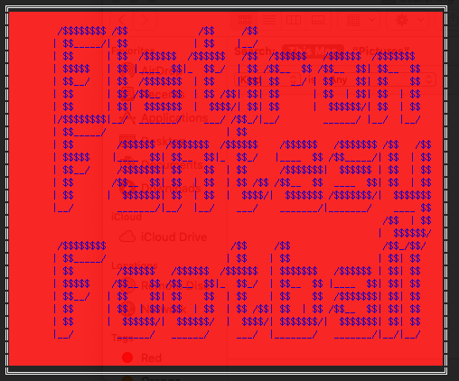
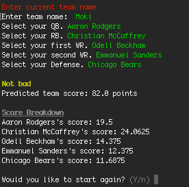
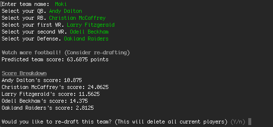
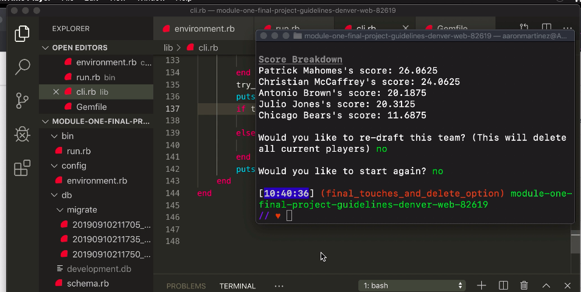

<h1>Flatiron Fantasy Football Point Predictor</h1>
Built by Aaron Martinez and Arlene George

Steps for running Flatiron Fantasy Football Point Predictor
1. Clone from Github 
2. In your terminal enter rake csv to add player data into the player table
    * open Rakefile and change "18_def.csv" to "18_off.csv"
    *run rake csv in the terminal again to finish adding data.
3. In your terminal enter bundle install to install required gems used to stylize code
4. In your terminal enter ruby bin/run.rb to start the program

5. Follow the prompts on the screen to create your team name, pick your players and see your projected weekly score. 

After all your players are slected you will see a total score prediction and a breakdown of estimated points per player

After your results are shown you can make some changes to try your other players. Just respond with a Y to the question would you like to re-draft this team?. Note this will delte your current team. 

    

    

